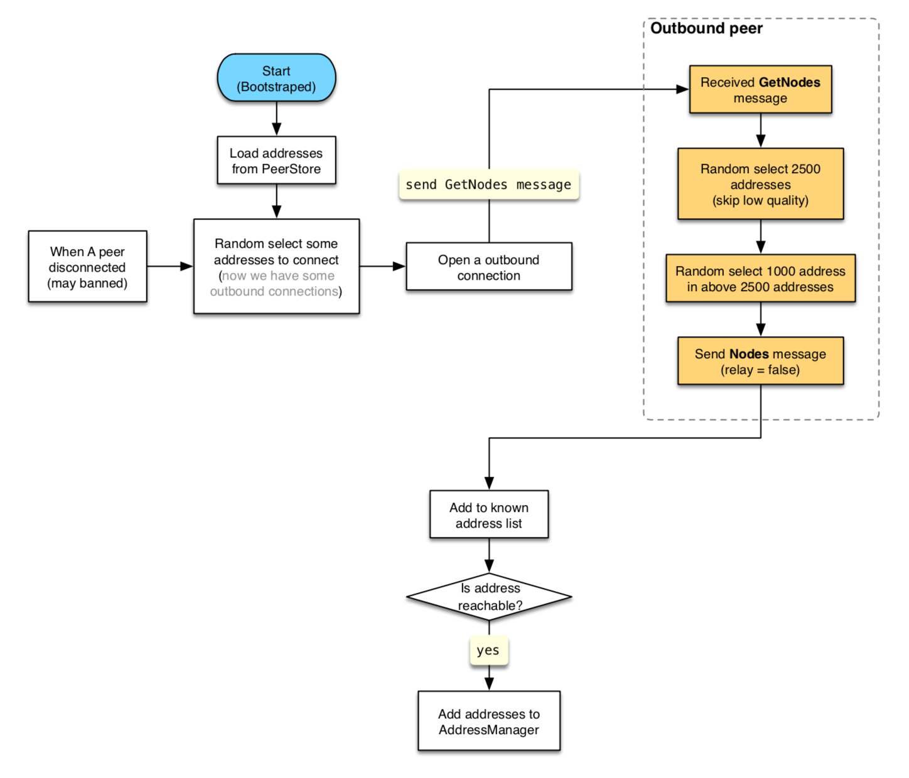

# CKB Node Discovery Protocol

CKB node discovery protocol is mainly the same as [Satoshi Client Node Discovery][0]. The difference are:
* Node version is included in `GetNodes` message
* We use `multiaddr` as node address format (no `/p2p/` field, if has this field will treat as *misbehavior*)

## Discovery Methods
### DNS Addresses
When first time startup, if discovery service is needed, local node then issues DNS requests to learn about the addresses of other peer nodes. The client includes a list of host names for DNS services that are seeded. DNS server addresses can be replaced by command line arguments.

### Hard Coded "Seed" Addresses
The client contains hard coded IP addresses that represent ckb nodes. Those addresses only be used when DNS requests all failed. Once the local node has enough addresses (presumably learned from the seed nodes), client will close seed node connections to avoid overloading those nodes. "Seed" addresses can be replaced by command line arguments.

### Protocol Message
#### `GetNodes` Message
When the following conditions are met, local node will send a `GetNodes` message:

  1. It's a outgoing connection (resist [fingerprinting attack][3])
  2. The other node's version must bigger than a preset value
  3. Local node have less than 1000 `Node` information 


#### `Nodes` Message
When client received a `GetNodes` message, if this is the first time received `GetNodes` message and from a inbound connection, local node will response with a `Nodes` message, the `announce` field is `false`. When a timeout triggered local node will send all connected `Node` information in `Nodes` message to all connected nodes, the `announce` is `true`. When local node received a `Nodes` message and it's `announce` is `true`, local node will relay those [routable][1] addresses.

The length of `addreses` field in every `Node` in `Nodes` message must less than `3`.

## Resist Typical Attacks
### Eclipse attack
Every 2 minutes random choose a address from PeerStore to connect. The goal is increasing the tired address list.

### fingerprinting attack
[Related paper][3]

`GetNodes` can only send to outgoing connection.

## Flow Diagram
### Node Bootstrap

### Send `GetNodes` Message

### Announce Connected Nodes


## Data Structures
We use [FlatBuffers][2] as serialize/deserialize format, the *schema*:

```
table DiscoveryMessage {
    payload: DiscoveryPayload;
}

union DiscoveryPayload {
    GetNodes,
    Nodes,
}

table GetNodes {
    version: uint32;
    count: uint32;
}

table Nodes {
    announce: bool;
    items: [Node];
}

table Node {
    node_id: Bytes;
    addresses: [Bytes];
}
```

[0]: https://en.bitcoin.it/wiki/Satoshi_Client_Node_Discovery
[1]: https://www.iana.org/assignments/iana-ipv4-special-registry/iana-ipv4-special-registry.xhtml
[2]: https://google.github.io/flatbuffers/
[3]: https://arxiv.org/pdf/1410.6079.pdf
